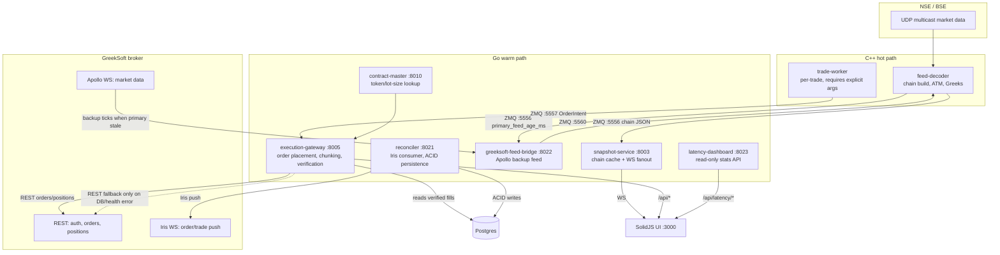

# High-Level Design

**Status of this document**: current-state reference, written 2026-09-17
against the actual, running system. `docs/architecture.MD` is the
*original pre-implementation plan* — its folder/file listings don't match
what was actually built (e.g. it lists `market-state/src/shm_writer.cpp`
and `trade-worker/src/intent_builder.cpp`, neither of which exist; several
listed components are still 0-byte stubs). This document and `docs/LLD.md`
supersede it for understanding the system as it exists today; the original
is kept for historical reference, not deleted.

## 1. Purpose

An algorithmic options-trading platform that sells NIFTY/BANKNIFTY/
FINNIFTY/MIDCPNIFTY/SENSEX/BANKEX straddles (and strangles) through the
**GreekSoft** broker, with **XTS** retained as an untouched legacy broker
path (explicitly out of scope for all work described in this document and
`docs/TODO.md`). The platform spans three tiers, chosen for their
different latency/complexity trade-offs:

- **C++ hot path** — direct exchange market-data ingestion and option
  chain construction, running at multicast-UDP speed.
- **Go warm path** — broker integration, order execution, reconciliation,
  persistence, and the HTTP API the UI talks to.
- **SolidJS UI** — the trading terminal (option chain, portfolio,
  automation config, manual controls, logs, latency dashboard).

## 2. Architecture at a glance

## 3. Major design decisions made this session

### 3.1 Explicit OMS/PMS split
- **PMS (Position Management System)** — `services/reconciler`. The
  *sole* durable, transactional writer of order/fill state to Postgres,
  driven by GreekSoft's Iris push feed. Nothing else writes to
  `orders`/`fills`/`trade_legs` except execution-gateway's own
  synchronous verified-fill persistence path, and both use idempotent
  `ON CONFLICT` keys so simultaneous writers can't corrupt state.
- **OMS (Order Management System)** — `services/execution-gateway`.
  Owns order submission and the *decision* of whether a fill is verified
  before proceeding (chunking, retries, square-off completion). It reads
  the PMS's own Postgres state as its fast verification source (see 3.2)
  rather than maintaining independent broker connectivity for this.

### 3.2 TBT-driven verification, REST fallback
Original design (see `docs/TODO.md` Phase 10) had execution-gateway open
its *own* Iris websocket connection for real-time fill tracking. **This
was confirmed live to be unsafe**: GreekSoft allows only one live Iris
connection per account, so it repeatedly disconnected the reconciler's
own connection — one incident actually lost a real fill. Redesigned:
`Executor.GetVerifiedFills` reads reconciler-persisted Postgres state
first (quantity-weighted average price across partial fills, gated by a
cached reconciler `/api/health` check) and falls back to REST
order-book polling only on a genuine error — never merely because a
result was empty (that's the ordinary "not filled yet" case). This
delivers the "websocket as primary, REST as fallback" behavior without
a second competing Iris connection.

### 3.3 Shared GreekSoft session
GreekSoft allows only one valid HTTP session per account — a second
process logging in independently invalidates the first. Every process
that needs a GreekSoft session (execution-gateway, reconciler,
greeksoft-feed-bridge) calls `LoginShared`, which reuses a session
persisted in `broker_sessions.broker_specific` if still fresh (default
10 min), only performing a real login when necessary.

### 3.4 ACID persistence
Every multi-statement Postgres write (order status + order_events insert
+ fill insert + trade_leg recompute) runs inside one transaction, both
in the reconciler and in execution-gateway's own verified-fill path.
Correlation by `broker_order_id` is explicitly day-scoped
(`created_at::date = CURRENT_DATE`) since GreekSoft recycles order IDs
across trading days — confirmed live, not assumed.

### 3.5 Latency visibility
`latency_samples` (Postgres) records the time from local order-row
creation to the first Iris push confirming it, written once per order
(not once per status transition, which would skew percentiles).
`services/latency-dashboard` serves aggregate stats
(count/avg/p50/p95/p99/max via Postgres `percentile_cont`) and recent
samples read-only; the UI's Latency tab polls it every 5s through vite's
dev-server proxy (a direct port isn't reachable from the browser in
every deployment of this environment — confirmed live).

## 4. Broker strategy

| | GreekSoft | XTS |
|---|---|---|
| Role | Primary, actively developed | Legacy, explicitly untouched |
| Order push | Iris websocket (real, TBT) | — |
| Market data | Apollo websocket (backup) + REST (`GetTokenOnlyMbpData`) | Socket.IO client existed (`market-data-gateway/internal/socketio`) but was unused/removed as dead code (2026-09-17 cleanup) |
| Session model | One live session + one live Iris connection per account (confirmed live) | Independent per-process login (`xts.NewClient()`) |
| Known gaps | See `docs/TODO.md` Phase 10 (autonomous risk monitors not yet ported) | `libs/broker-xts` has a pre-existing, unrelated test compile break (`client_test.go` calling `NewClient` with args it doesn't take) — out of scope, not touched |

## 5. Non-goals / explicitly deferred

Per the user's own sequencing ("clean up and document *before* the full
Python-reference migration"), the following are deliberately **not**
built yet — see `docs/TODO.md` Phase 9/10 for the full roadmap:

- Autonomous SL/TP/roll/hedge-fix/fast-exit decision logic (today,
  `runtime.go`'s risk monitors are alert-only for SL/TP/time-exit; the
  one autonomous action that places real orders is a hedge trigger, and
  even that doesn't fold the fill back into the trade's leg-quantity
  model).
- Wings/protective legs, delta-neutral hedge-strike selection from a
  synthetic future, and the special-OMS manual-tranche ledger pattern —
  all present in the Python reference system, none yet ported.
- Building out `market-state`, `risk-engine`, `trade-supervisor`,
  `zmq-nats-bridge` — confirmed empty stubs today (see `docs/LLD.md` §2).
- Wiring `session-manager` (a real, working gRPC service) or
  `market-data-gateway` into `start_platform.sh` — neither is started
  today; out of scope unless asked.

## 6. Where to look next

- **`docs/LLD.md`** — per-service reference, ZMQ port map, DB schema,
  sequence diagrams, testing patterns.
- **`docs/TODO.md`** — phase-by-phase build history and the live-incident
  postmortems behind several of the design decisions above.
- **`docs/greeksoft-integration-architecture.md`** — the original,
  narrower GreekSoft-rewire design doc (Phases 5-7); still accurate for
  that scope, now a subset of this document.
