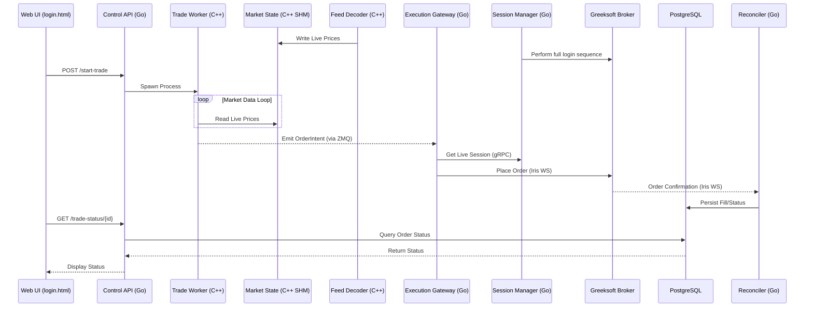
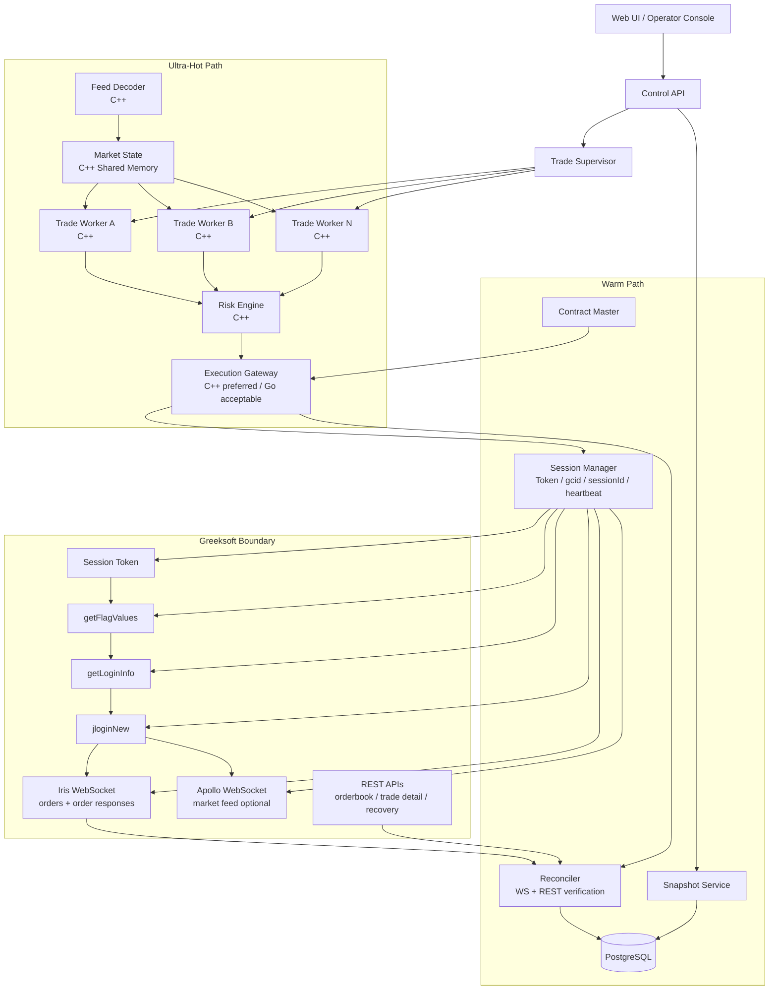
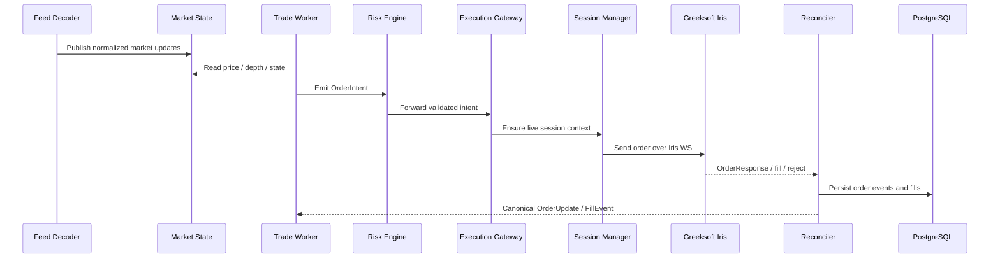
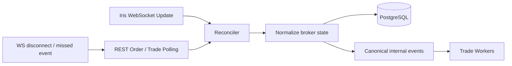
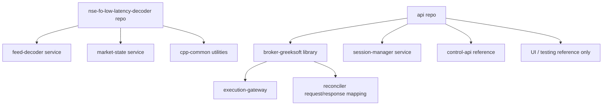

# Trading Platform Architecture Diagrams

This document provides the architecture, execution flow, and recovery diagrams for the low-latency trading platform.

## Phase 1: 3-Week MVP Architecture

This diagram shows the simplified "steel thread" architecture for the initial 3-week build. It focuses on the core path from market data to execution for a single broker.



## High-Level Runtime Architecture

This is the target end-to-end runtime architecture.

```text
                                 ┌──────────────────────────────┐
                                 │         Web UI / Ops         │
                                 │ trade control, monitoring    │
                                 └──────────────┬───────────────┘
                                                │
                                                ▼
                                 ┌──────────────────────────────┐
                                 │         Control API          │
                                 │ create/pause/exit trades     │
                                 └──────────────┬───────────────┘
                                                │
                                                ▼
                                 ┌──────────────────────────────┐
                                 │      Trade Supervisor        │
                                 │ spawn / restart workers      │
                                 └──────────────┬───────────────┘
                                                │
                 ┌──────────────────────────────┼──────────────────────────────┐
                 │                              │                              │
                 ▼                              ▼                              ▼
      ┌──────────────────┐         ┌──────────────────┐            ┌──────────────────┐
      │ Trade Worker A   │         │ Trade Worker B   │            │ Trade Worker N   │
      │ C++ per-trade    │         │ C++ per-trade    │            │ C++ per-trade    │
      └────────┬─────────┘         └────────┬─────────┘            └────────┬─────────┘
               │                            │                               │
               └──────────────┬─────────────┴──────────────┬────────────────┘
                              │                            │
                              ▼                            ▼
                    ┌─────────────────┐          ┌────────────────────┐
                    │  Risk Engine    │          │   Snapshot Service  │
                    │  C++ hot checks │          │ live P&L / status   │
                    └────────┬────────┘          └────────────────────┘
                             │
                             ▼
                    ┌──────────────────────┐
                    │  Execution Gateway   │
                    │  broker adapter      │
                    └────────┬─────────────┘
                             │
              ┌──────────────┴───────────────────────┐
              │                                      │
              ▼                                      ▼
   ┌──────────────────────┐              ┌────────────────────────┐
   │ Session Manager      │              │ Reconciler             │
   │ token/gcid/sessionId │              │ WS + REST truth merge  │
   │ Iris/Apollo heartbeat│              └───────────┬────────────┘
   └──────────┬───────────┘                          │
              │                                      ▼
              │                           ┌────────────────────────┐
              │                           │ PostgreSQL             │
              │                           │ trades/orders/fills    │
              │                           └────────────────────────┘
              │
              ▼
   ┌───────────────────────────────────────────────────────────────┐
   │                        Greeksoft                              │
   │ SessionToken -> FlagValues -> LoginInfo -> jloginNew         │
   │ Iris WS (execution + order responses)                        │
   │ Apollo WS (optional broker market feed)                      │
   │ REST recovery (orderbook / trade detail / positions)         │
   └───────────────────────────────────────────────────────────────┘


   ┌──────────────────────────┐
   │ NSE FO Decoder Repo      │
   │ multicast decode / parse │
   └──────────────┬───────────┘
                  ▼
         ┌────────────────────┐
         │ Market State       │
         │ SHM + symbol cache │
         └────────────────────┘
```

This layout follows the architecture needed by Greeksoft’s documented login and WebSocket flow, where session token, login info, jloginNew, heartbeat, and async OrderResponse handling are explicit responsibilities, and where REST remains the repair path for missed or disconnected order-state transitions.



## End-to-End Execution Flow

This flow matches the intended low-latency model where the strategy worker does not wait synchronously for broker responses. It emits an intent, returns to its decision loop, and later consumes canonical updates produced by the reconciler.



## Reliability and Recovery Flow

This design ensures the system does not trust a single event source. Broker WebSocket updates are the fast path, while REST polling is the repair and convergence path if messages are missed or sessions restart.



## Codebase Responsibility Map

The decoder repo should be treated as the source for exchange-feed parsing and market-data normalization, while the API repo should be mined for broker-login flow, payload construction, WebSocket message shapes, and testing utilities rather than used as the final runtime design.

